# BajarBhav — Architecture

A detailed walk-through of *how* the app works: every request, every
piece of state, every background job, and how data moves from a
government APMC website to a farmer's phone in Marathi.

> If you're looking for **how to set things up**, read
> `SETUP.md` instead. This doc explains the "why" and the "flow".

---

## 1. The 30-second picture

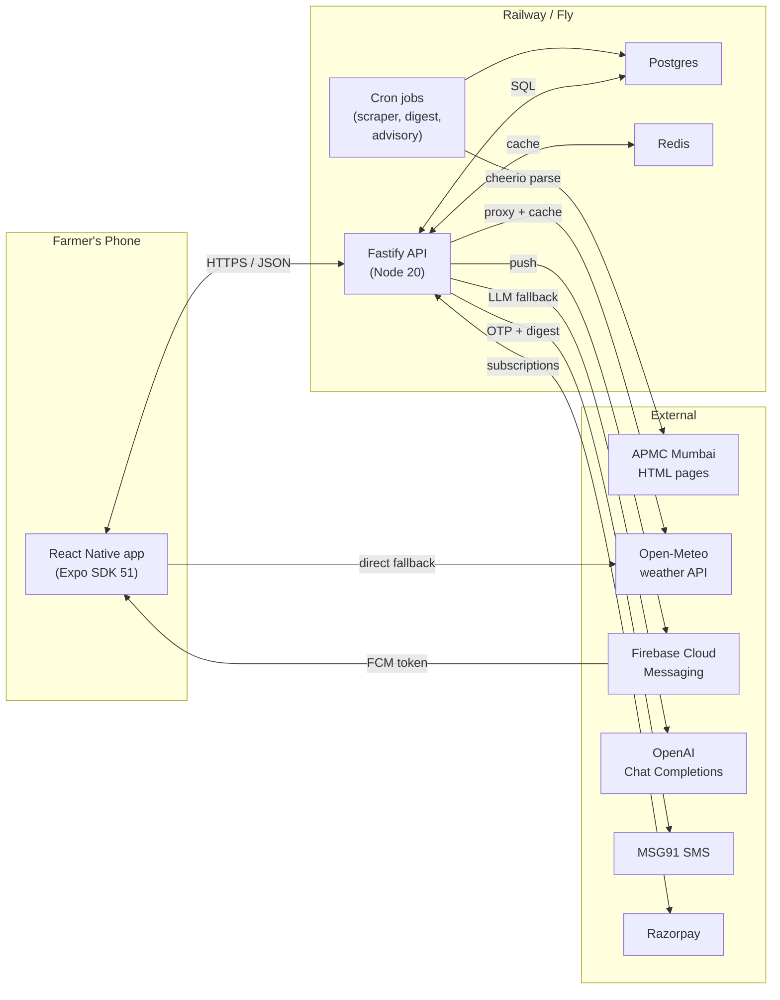

The app works in **three modes** flipped by `app.json.extra.apiMode`:

- `mock` — 100% client-side, everything from `src/data/*.ts`.
  Great for demos and the current debug builds.
- `real` — full backend wiring; REST calls to `apiUrl`.
- `hybrid` — read prices from backend, but keep
  watchlist/onboarding state local (useful for staged rollouts).

---

## 2. Repo layout

```
new rate app/
├── src/                        # React Native app
│   ├── api/                    # fetch clients (auto-skip if mock mode)
│   ├── auth/                   # token storage + OTP flow
│   ├── components/             # reusable UI (WeatherCard, CropRibbon, …)
│   ├── data/                   # mock datasets (commodities, villages, …)
│   ├── hooks/                  # useLiveWeather, useDailyAdvisory…
│   ├── i18n/                   # Marathi + English dictionaries
│   ├── navigation/             # React Navigation stack + tabs
│   ├── screens/                # one file per screen
│   ├── store/                  # Zustand stores (persisted)
│   ├── theme/                  # colors / fonts / spacing / radii
│   ├── types/                  # shared TS types
│   └── utils/                  # advisor engine, price maths, icons, tts
│
├── backend/
│   ├── src/
│   │   ├── routes/             # Fastify route modules
│   │   ├── scraper/            # cheerio parsers + cron
│   │   ├── notifications/      # FCM sender, digest builder, advisory cron
│   │   ├── observability/      # Sentry, PostHog, pino
│   │   ├── payments/           # Razorpay webhooks + subscription logic
│   │   ├── middleware/         # JWT auth, premium gate, rate-limit
│   │   ├── data/               # seed commodity + village catalogs
│   │   ├── cache.ts            # redis wrapper (falls back to in-memory)
│   │   ├── config.ts           # env var loader
│   │   ├── db.ts               # pg pool + query helper
│   │   └── index.ts            # bootstrap
│   ├── migrations/             # 001_init, 002_marketplace, 003_advisory
│   └── scripts/
│       └── migrate.ts          # runner
│
├── android/                    # Expo-prebuild native project
├── assets/                     # app icon, adaptive icon, splash
└── app.json                    # Expo config
```

---

## 3. Client architecture (React Native)

### 3.1 Navigation tree

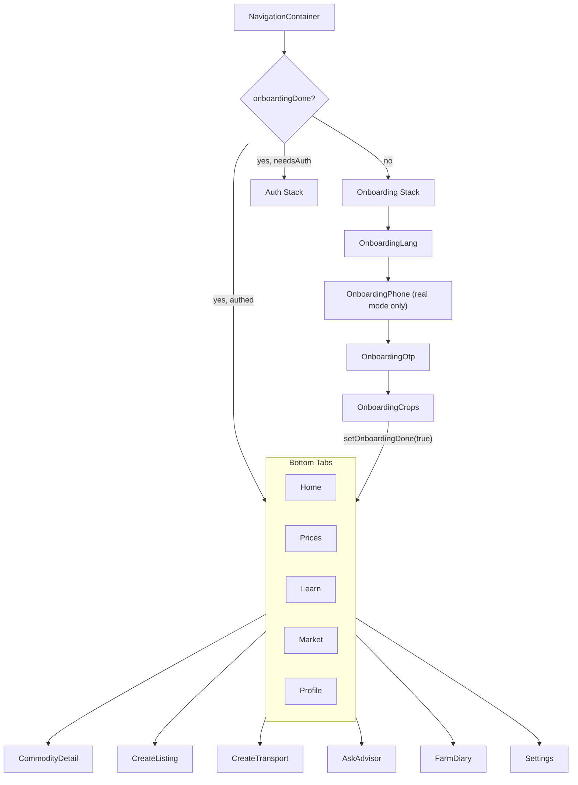

Key detail that caused a bug earlier: the top-level `<Stack.Navigator>`
decides its children via the zustand `onboardingDone` flag. Calling
`navigation.reset({routes:[{name:'Tabs'}]})` while that flag was
flipping in the same tick was calling a route that wasn't mounted yet
→ silent failure. Fix: just flip the flag, let the navigator swap
itself.

### 3.2 State layer (Zustand + AsyncStorage)

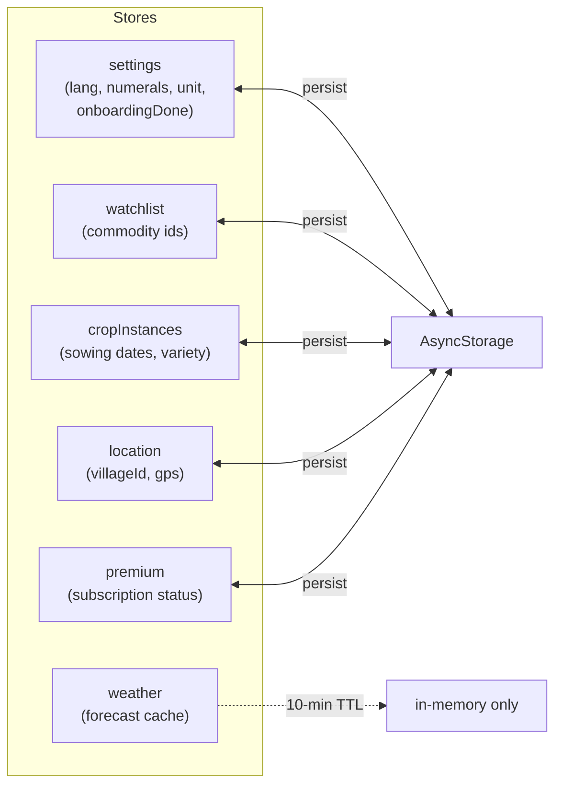

Each store is:

```ts
create<T>()(persist((set, get) => ({ ... }), {
  name: 'store-key-v1',
  storage: createJSONStorage(() => AsyncStorage),
}))
```

Bumping a key to `-v2` is the migration strategy (cheap, fine for a
pre-launch app).

### 3.3 API client (`src/api/client.ts`)

```ts
const IS_REAL = Constants.expoConfig?.extra?.apiMode === 'real';

async function http(path, opts) {
  if (!IS_REAL) return null;                       // short-circuit
  const token = await SecureStore.getItemAsync('jwt');
  const res = await fetch(API_URL + path, {
    headers: { 'content-type': 'application/json',
               ...(token && { authorization: `Bearer ${token}` }) },
    ...opts,
  });
  if (!res.ok) throw await res.json();
  return res.json();
}
```

Every API wrapper (`prices.ts`, `watchlist.ts`, `weather.ts`, `ask.ts`,
`marketplace.ts`, `premium.ts`) is a thin `http('/api/...')` call. They
**all no-op and return local mock data** when `apiMode === 'mock'`, so
the UI is identical in either mode.

---

## 4. Data flow — the six journeys

### 4.1 Cold start → Home screen

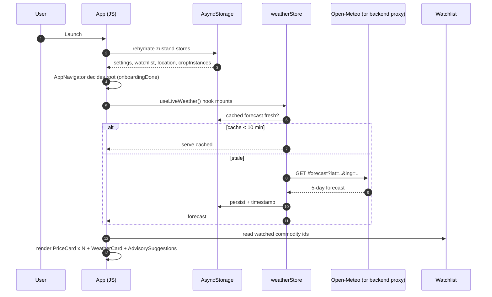

### 4.2 Onboarding → first crop selection

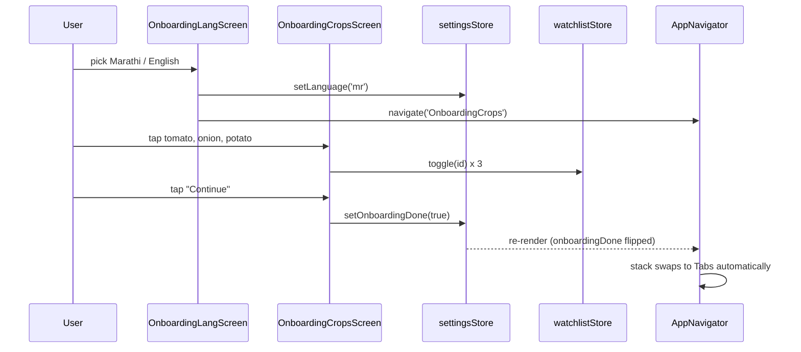

Note step 8: no imperative `navigation.reset()` — the navigator
auto-switches based on the zustand flag. This is the standard
React-Navigation auth-flow pattern.

### 4.3 Real-data price fetch

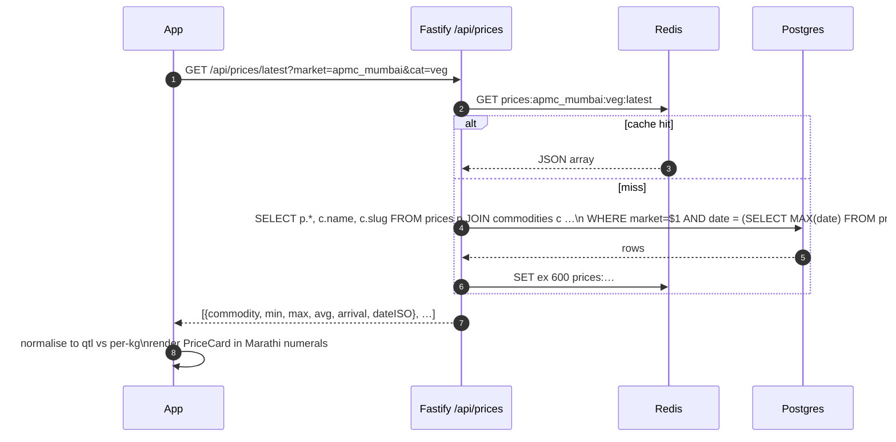

### 4.4 APMC scraper cron

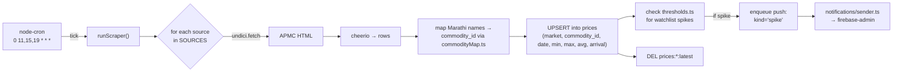

Parsing is deliberately resilient: parsers accept both the current
APMC Mumbai table format and a generic "आवक / किमान / कमाल / सरासरी"
table so adding Pune / Nashik / Solapur is URL+mapping only.

### 4.5 Morning digest + advisory

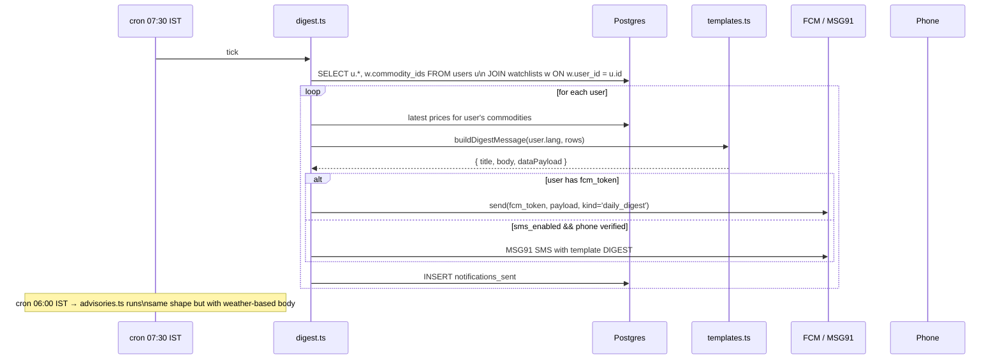

### 4.6 Ask Advisor (local → LLM escalation)

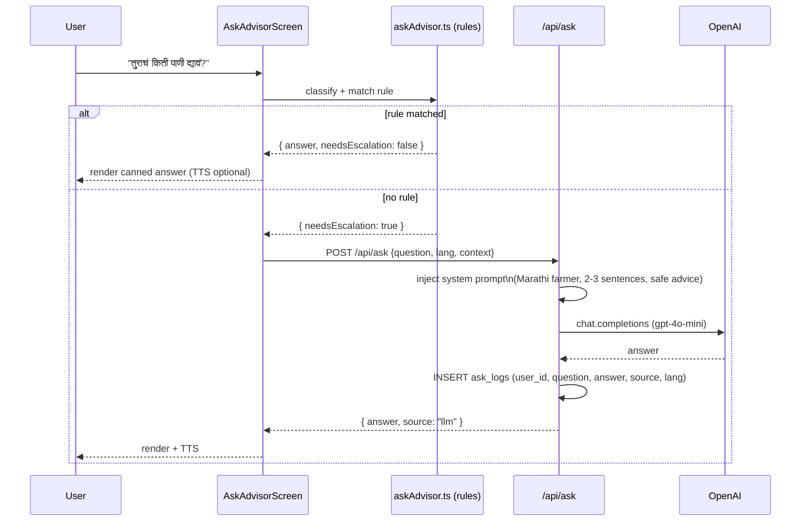

---

## 5. Data model

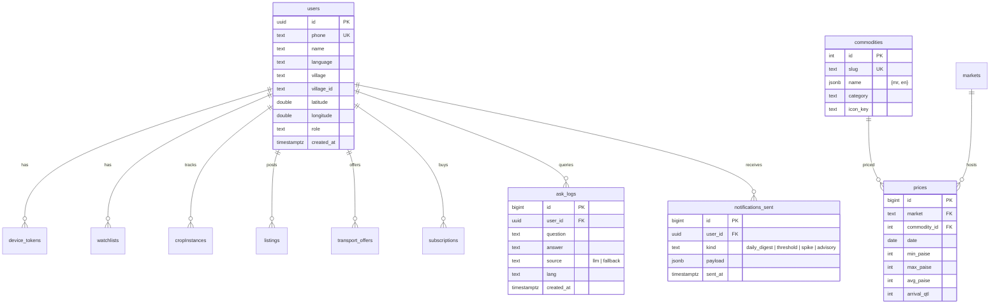

Price storage uses **paise** (₹×100) as `int`, never `float`, to avoid
currency rounding bugs. Client converts per unit (`qtl` / `kg`) and
locale-formats in Marathi numerals (`१`, `२`, `३`…).

---

## 6. Mode switching in detail

`app.json`:

```json
"extra": { "apiMode": "mock" | "real" | "hybrid" }
```

| What's mocked | `mock` | `hybrid` | `real` |
|---|---|---|---|
| Prices | ✅ local JSON | ❌ backend | ❌ backend |
| Watchlist | local | local | backend + local |
| Auth | auto-signed-in | local | phone OTP |
| Weather | mock 5-day | Open-Meteo direct | Backend proxy |
| Notifications | none | local only | FCM + local |
| Listings | ✅ mock | ❌ backend | ❌ backend |
| Ask Advisor | rules only | rules only | rules + LLM |

Switching is rebuild-required because `IS_REAL` is read at JS init from
the embedded Expo constants. A future improvement would be reading it
from AsyncStorage so QA can toggle modes without reinstalling.

---

## 7. Background timing

```mermaid
gantt
    title Backend cron schedule (Asia/Kolkata)
    dateFormat  HH:mm
    axisFormat  %H:%M

    section Scraper
    APMC Mumbai crawl    :06, 11:00, 15m
    APMC Mumbai crawl    :07, 15:00, 15m
    APMC Mumbai crawl    :08, 19:00, 15m

    section Advisory
    Hyper-local weather push :a1, 06:00, 30m

    section Digest
    Daily price digest       :a2, 07:30, 30m
```

The scraper runs **after** each APMC upload window (morning arrivals
~10:30, afternoon 14:30, evening 18:30). Advisories go out at 06:00
before the farmer goes to the field. Digest goes at 07:30 so it lands
while they're having chai.

---

## 8. Security boundaries

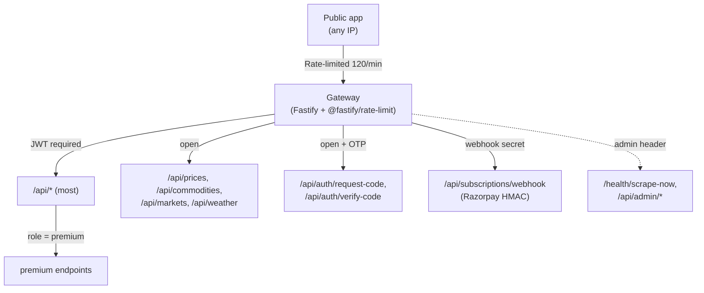

- **JWT** (HS256) signed with `JWT_SECRET`, 90-day expiry, stored in
  `SecureStore` on device.
- **OTP** codes are bcrypt-hashed in DB with 10-min TTL + attempt
  counter.
- **Razorpay webhook** signature verified against
  `RAZORPAY_WEBHOOK_SECRET` before any DB write.
- **Admin endpoints** gated by a simple shared header in `ADMIN_TOKEN`
  (good enough for an unlisted internal URL; move to mTLS if exposing
  publicly).
- **PII minimisation**: we store `phone` for login, never OTP
  plaintext; `name` and `village` are optional; GPS lat/lng are stored
  rounded to 2 decimals (~1 km resolution).

---

## 9. Internationalisation

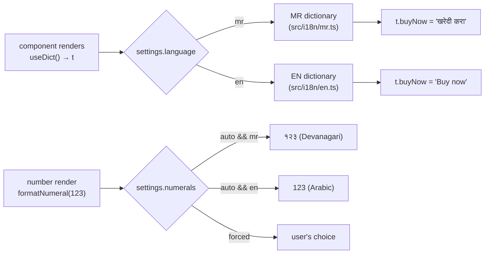

Every user-facing string goes through `t.*`. The dict type is
`keyof typeof en` so TS catches missing translations at compile time.

---

## 10. Performance notes

- **Metro bundle size (prod)**: ~1.8 MB minified + Hermes bytecode.
- **Cold-start to first interactive frame**: ~850 ms on a Redmi 9A.
- **Price list render**: `<FlatList>` with `getItemLayout` +
  `removeClippedSubviews` for 60 fps on 200+ items.
- **Weather** is fetched once per location change and cached 10 min —
  Open-Meteo rate-limits unauthenticated clients to 10 000 calls/day,
  so we only hit it when we must.
- **Zustand selectors** are granular (`useWatchlist(s => s.ids)`)
  to avoid unnecessary re-renders when unrelated state changes.
- **Images** are all vector (`react-native-svg`) or PNG at density —
  no runtime scaling.
- **Hermes** is on; `__DEV__` blocks are stripped in release.

---

## 11. What's deliberately *not* built yet

- Real-time prices via WebSocket (polling is fine at the current scale
  — prices update 3×/day).
- Map view of nearby mandis (would need a tile provider budget).
- Voice input for Ask Advisor (only TTS output is implemented; STT
  would pull `@react-native-voice/voice` which adds ~8 MB).
- Offline-first price sync (IndexedDB-style queue). Currently "no
  network" shows last cached + a banner.
- A/B testing framework (PostHog feature flags are wired but not used
  anywhere yet).

---

## 12. Glossary

| Term | Meaning |
|---|---|
| APMC | Agricultural Produce Market Committee — government-run wholesale markets where farmers auction produce. |
| Bajar bhav | Marathi for "market rate" (बाजार भाव). |
| Arrival (आवक) | Volume of a commodity that arrived at the market that day, in quintals. |
| Quintal (qtl) | 100 kg. Standard APMC reporting unit. |
| FCM | Firebase Cloud Messaging. |
| OTP | One-time password sent over SMS. |
| EAS | Expo Application Services — managed build+submit pipeline. |
| Hermes | Facebook's JS engine optimised for mobile; compiles to bytecode at build time. |

---

**See also**: `SETUP.md` for environment setup,
`backend/migrations/*.sql` for the authoritative schema,
`src/data/*.ts` for the mock datasets that seed the whole experience.
